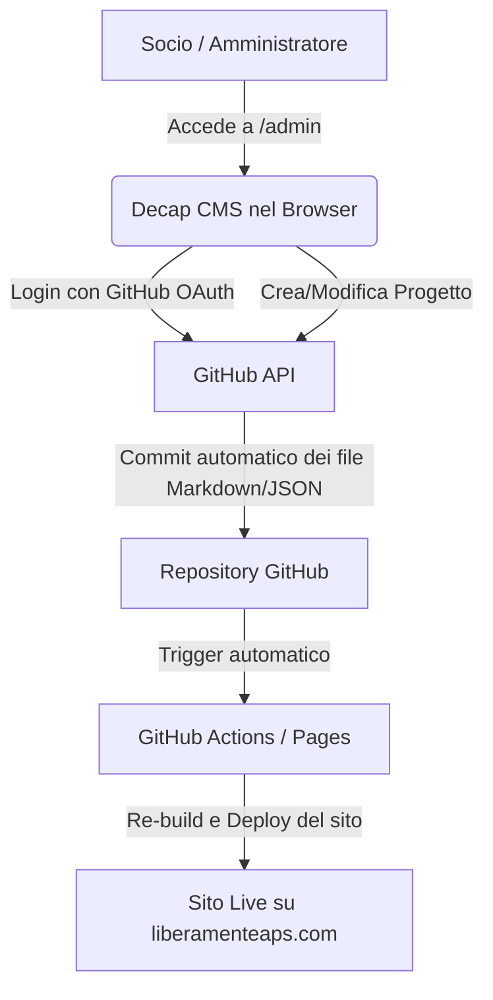

# Integrazione Decap CMS - Liberamente APS

Questa guida spiega in dettaglio come funziona **Decap CMS** (precedentemente noto come Netlify CMS) e come integrarlo nel sito di Liberamente APS per permettere a utenti non tecnici (es. la presidenza o i soci) di aggiornare autonomamente i progetti e i documenti di trasparenza.

---

## 1. Come Funziona Decap CMS (Architettura)

Decap CMS è un **Git-based CMS**. A differenza di WordPress o altri CMS tradizionali, **non richiede un database** (come MySQL) e non gira su un server attivo.



### I Vantaggi per l'APS:
1. **Costi Zero:** Gira interamente nel browser e sfrutta le API di GitHub. Non c'è un server da pagare.
2. **Sicurezza Totale:** Non essendoci un database o un pannello PHP esposto sul server, il sito non può essere violato o infettato da malware.
3. **Cronologia completa:** Ogni modifica effettuata sul CMS crea un "commit" a nome dell'utente. C'è uno storico infinito di chi ha modificato cosa, con la possibilità di ripristinare versioni precedenti in un click.

---

## 2. Decap CMS e il Sito Statico: Due Strade Possibili

Attualmente il sito è scritto in **HTML puro** (file statici separati). Per far leggere al sito i nuovi articoli creati dal CMS, abbiamo due opzioni:

### Opzione A: Passare a un Generatore di Siti Statici (SSG) come Astro o Eleventy (Consigliata)
Nel CMS si scrivono file in formato **Markdown** (es. `progetti/corso-carceri.md`). Durante la compilazione automatica su GitHub, il framework (Astro o Eleventy) legge i file Markdown e genera automaticamente le pagine HTML corrispondenti.
*   **Vantaggi:** SEO perfetto, caricamento istantaneo, pulizia del codice.
*   **Svantaggi:** Richiede una piccola ristrutturazione iniziale del codice attuale per convertirlo nel template del framework.

### Opzione B: Lettura dinamica tramite Javascript (Client-side JSON)
Il CMS salva i progetti in un unico file di testo strutturato (es. `progetti.json`). All'apertura della pagina, un codice Javascript (`script.js`) scarica il file JSON e genera dinamicamente le schede dei progetti sullo schermo.
*   **Vantaggi:** Si può implementare sul codice HTML attuale senza cambiare framework.
*   **Svantaggi:** SEO meno efficiente (i motori di ricerca vedono le schede generate via JS, il che è meno ottimale rispetto all'HTML pre-compilato).

---

## 3. Implementazione Pratica: I File Necessari

Per aggiungere Decap CMS al sito bastano due file posizionati in una nuova cartella `/admin` nella root del progetto:

```
liberamente-website/
├── admin/
│   ├── index.html        <-- La pagina del pannello di controllo
│   └── config.yml        <-- File di configurazione dei campi
├── index.html
├── style.css
└── ...
```

### A. `admin/index.html`
Questo file carica l'applicazione single-page di Decap CMS tramite CDN.

```html
<!DOCTYPE html>
<html lang="it">
<head>
  <meta charset="utf-8" />
  <meta name="viewport" content="width=device-width, initial-scale=1.0" />
  <title>Pannello Amministrazione - Liberamente APS</title>
</head>
<body>
  <!-- Include lo script del CMS -->
  <script src="https://unpkg.com/decap-cms@^3.0.0/dist/decap-cms.js"></script>
</body>
</html>
```

### B. `admin/config.yml`
Questo file definisce le "Collezioni" (i tipi di contenuto che l'utente può modificare, come i *Progetti* o i *Membri del Direttivo*) e i campi di testo associati.

```yaml
backend:
  name: github
  repo: liberamenteaps/lmaps-public-website
  branch: main
  base_url: https://your-oauth-gateway.com # L'URL del gateway di autenticazione

media_folder: "images" # Dove caricare le immagini del sito
public_folder: "/images"

collections:
  - name: "progetti"
    label: "Progetti e Interventi"
    folder: "progetti"
    create: true
    slug: "{{slug}}"
    fields:
      - { label: "Titolo", name: "title", widget: "string" }
      - { label: "Data Progetto", name: "date", widget: "datetime" }
      - { label: "Categoria", name: "category", widget: "select", options: ["Scuole", "Carceri", "Aziende", "Sanità", "Sociale"] }
      - { label: "Descrizione Breve", name: "summary", widget: "text" }
      - { label: "Immagine di Copertina", name: "image", widget: "image" }
      - { label: "Corpo del Testo / Articolo", name: "body", widget: "markdown" }

  - name: "direttivo"
    label: "Membri Direttivo (Trasparenza)"
    files:
      - file: "dati/direttivo.json"
        label: "Consiglio Direttivo"
        name: "consiglio_direttivo"
        fields:
          - label: "Membri"
            name: "membri"
            widget: "list"
            fields:
              - { label: "Ruolo", name: "ruolo", widget: "string" }
              - { label: "Nome e Cognome", name: "nome", widget: "string" }
```

---

## 4. Gestione del Login (OAuth Gateway)

Poiché il CMS deve scrivere direttamente sul tuo GitHub pubblico, ha bisogno di essere autorizzato.

### Cos'è un Cloudflare Worker e perché serve?
Un **Cloudflare Worker** è una funzione "serverless" (un piccolissimo pezzo di codice backend) che gira sulla rete globale di Cloudflare. Non richiede la gestione di un server reale ed è gratuito (fino a 100.000 richieste al giorno).

**Perché non possiamo usare direttamente GitHub?**
Per autenticare l'utente, GitHub richiede lo scambio di credenziali tramite il protocollo OAuth 2.0. Questo scambio richiede una chiave segreta chiamata **Client Secret**.
*   **Il problema:** GitHub Pages ospita solo file statici (HTML/JS) scaricabili dal client. Se mettessimo il *Client Secret* nel codice del sito, chiunque potrebbe leggerlo semplicemente visualizzando il codice sorgente della pagina, compromettendo la sicurezza del repository.
*   **La soluzione:** Il Cloudflare Worker funge da "intermediario sicuro". Riceve la richiesta dal sito, vi unisce il *Client Secret* (che risiede al sicuro dentro Cloudflare in modo invisibile all'esterno), effettua lo scambio con GitHub e restituisce al sito il token di accesso.

Dato che il sito è ospitato su GitHub Pages, l'utilizzo di un **Cloudflare Worker** come server di autenticazione OAuth è la soluzione ottimale, sicura e gratuita al 100%.

### Come configurarlo in 3 passi:

1. **Crea una GitHub OAuth App:**
   * Su GitHub, vai in *Settings -> Developer Settings -> OAuth Apps -> New OAuth App*.
   * Nome: `Liberamente CMS`
   * Homepage URL: `https://liberamenteaps.com`
   * Authorization callback URL: `https://<nome-del-tuo-worker>.workers.dev/callback` (questo sarà fornito da Cloudflare).
   * Genera un **Client ID** e un **Client Secret**.

2. **Crea un Cloudflare Worker (Gratuito):**
   * Nel pannello di Cloudflare, vai su *Workers & Pages -> Create Application*.
   * Usa un template di base (o deploya un worker open-source preconfezionato per Decap CMS, come [decap-cms-oauth-cloudflare](https://github.com/vickygonsalves/decap-cms-oauth-cloudflare)).
   * Inserisci il **Client ID** e il **Client Secret** di GitHub all'interno delle variabili d'ambiente protette del Worker su Cloudflare.

3. **Inserisci l'indirizzo del Worker nel file `config.yml`:**
   * Sostituisci `https://your-oauth-gateway.com` con l'indirizzo del tuo Cloudflare Worker.

---

## 5. Il Flusso di Lavoro Quotidiano

Una volta completato il setup, l'aggiornamento del sito da parte dei soci avverrà in questo modo:

1. Il socio va su `https://liberamenteaps.com/admin/`.
2. Clicca su **Login con GitHub**.
3. Accede al pannello grafico in italiano (molto simile a WordPress o Medium).
4. Clicca su "Nuovo Progetto", inserisce titolo, testo, seleziona la categoria e trascina l'immagine di copertina.
5. Clicca su **Pubblica**.
6. GitHub riceve il file, compila il sito e in circa 1-2 minuti le modifiche sono online.
